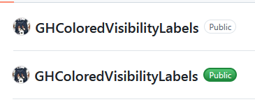

# GitHub Colored Visibility Labels
Enhances the readability of visibility labels on GitHub repositories by adding a flash of color!

## Installation
- Install [Tampermonkey](https://www.tampermonkey.net/) (other userscript managers may also work since this is a 
  relatively simple script, but I haven't personally tested their compatibility)
- Click [this link](https://github.com/brewffee/GHColoredVisibilityLabels/raw/refs/heads/master/ghlabels.user.js), which
  should prompt you to install the script.
- You're done! The script will apply after refreshing the page!
